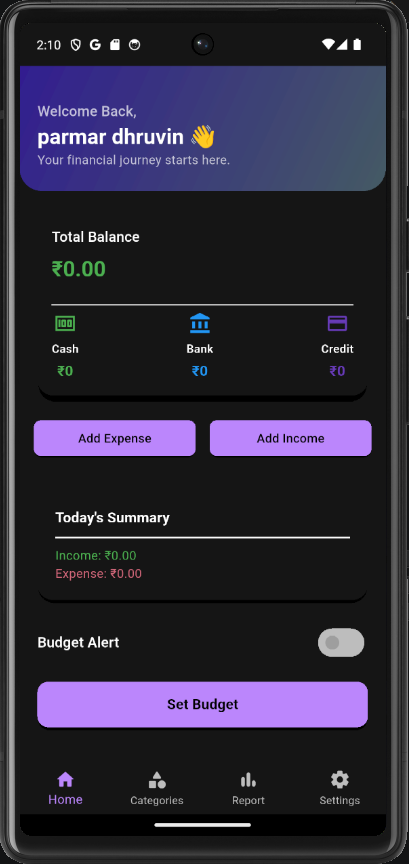
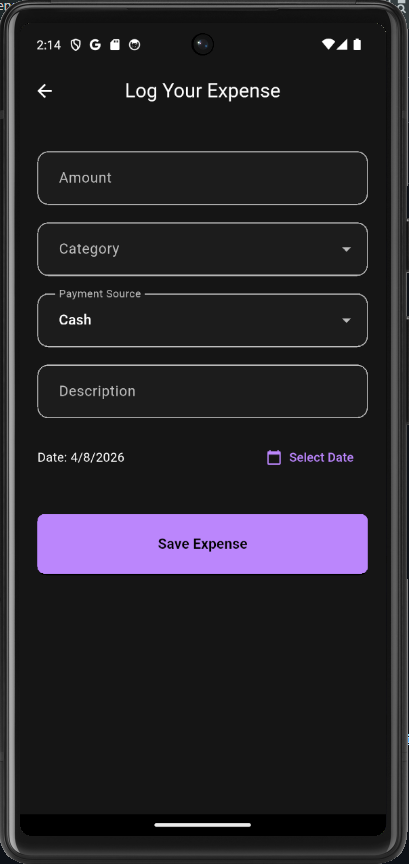
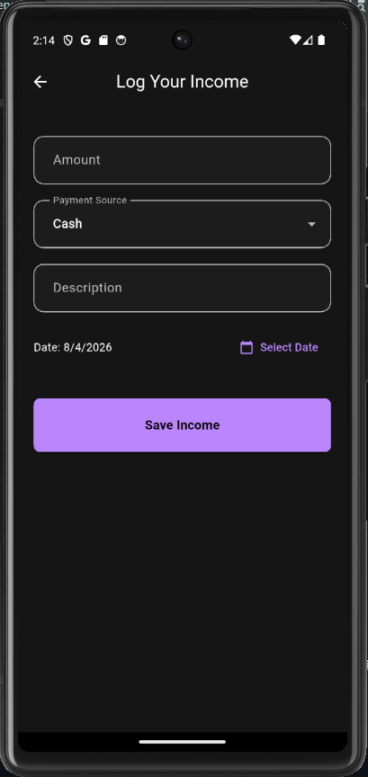
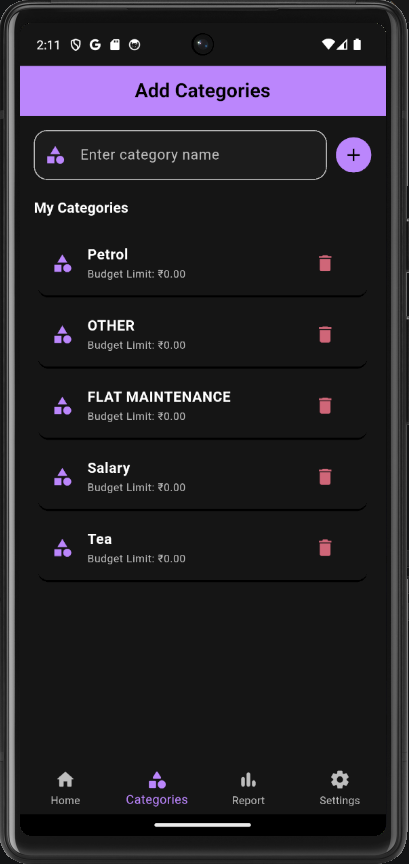
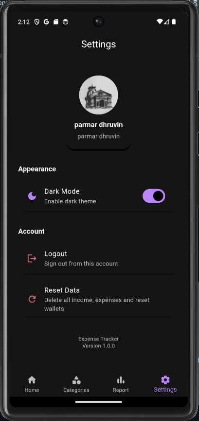

# 💰 Expense Tracker App

A modern expense tracking mobile application built using Flutter & Firebase to manage daily finances efficiently.

---

## 🚀 Quick Access

👉 📦 APK Download: [Expense Tracker-v1.0](https://drive.google.com/file/d/1jfyZIqly9d5ZI8BAGuW_Rg3jQWa_xOhq/view?usp=drive_link)

👉 🎥 Demo Video: https://your-video-link

---

## ✨ Features

* 🔐 Google Authentication (Firebase)
* ➕ Add Income & Expenses
* 📂 Category Management
* 📊 Daily & Monthly Reports
* 💰 Budget Tracking
* ⚡ Smooth & Clean UI

---

## 📷 Screenshots

### 🔐 Login Page

  

### 📊 Dashboard

  

### ➕ Add Expense

  

### 💰 Add Income

  

### 📂 Categories

  

### ⚙️ Settings

  

---

## 🛠 Tech Stack

* Flutter
* Dart
* Firebase Authentication
* Firebase Firestore

---

## 📁 Project Structure

* lib/ → Main application code
* assets/ → Images & icons
* android/ → Android configuration
* ios/ → iOS configuration

---

## 🎯 Purpose

This project demonstrates a real-world expense tracking solution with authentication, clean UI, and scalable architecture.

---

## 👨‍💻 Developed By

**Dhruvin Parmar**
PixelForgeX.dev

---

## 📞 Contact

* 📸 Instagram: @PixelForgeX.dev
* 📧 Email: [pixelforgex.dev@gmail.com](mailto:pixelforgex.dev@gmail.com)

---

⭐ If you like this project, consider giving it a star!
